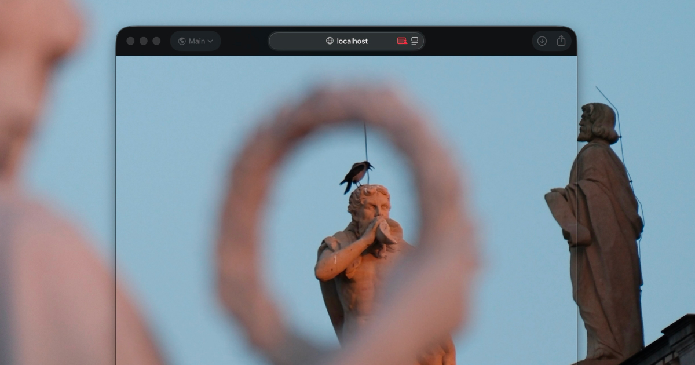

# background-transparent

Fake `background: transparent` for a browser window using a screen sharing video feed.

## How it works

1. **Screen capture.** The page asks to share the full screen that the browser window is on.
2. **Find the viewport.** Two small color markers (fiducials) are injected at the top corners of the viewport. On the first frame the code picks the two candidate colors least present on screen to avoid false positives.
   - Each frame, the screen-capture feed is scanned to locate these markers — first a fast check around the last known position, then a full-frame fallback. The markers double as UI buttons ("Learn More" / "Next Effect").
   - An interesting fact is that I tried to use `window.screenX` and `window.screenY`, and while it works, there are many issues: these values seem to be updated only 15 times per second in both Chrome and Safari, also, cutting the hole to update the buffer (step 4) is harder when the screen position and the video frame to cut are not coming at the exact same time.
   - Two fiducials was necessary so the window can be partially out of the screen.
3. **Estimate browser chrome.** The program estimates the height of the browser's top UI (tabs, address bar) and any OS window shadow so we can remove it in the next step. For now I just hardcoded values big-enough.
4. **Build a background buffer.** Each frame, the captured screen image is drawn to a canvas, but the area covering the browser window (viewport + chrome + a small padding) is cut out. Over time this accumulates the content behind the browser.
5. **Render.** The page scrolls to the computed viewport offset so the portion behind the browser is shown, simulating a transparent background. As the window moves, the offset updates. Optional post-processing filters (CRT, Gameboy, Glass shader) can be toggled.

## Inspiration

- I saw [this tweet](https://x.com/mausmoto/status/1892788765577322858) from [@mausmoto](https://x.com/mausmoto/status/1892788765577322858) about https://github.com/mausimus/ShaderGlass and since then it has been something I've been wishing I could do in the web. Well, one day I got this idea so I give it a try. The repo also served as inspiration for the CRT filter.
- https://github.com/shuding/liquid-glass/blob/main/liquid-diamond.js [@shuding](https://x.com/shuding) liquid diamond and IRL inspiration to get more into shaders.

## Is there any practical usage?

I want to build a translator using OCR, maybe there are some nice use cases.
